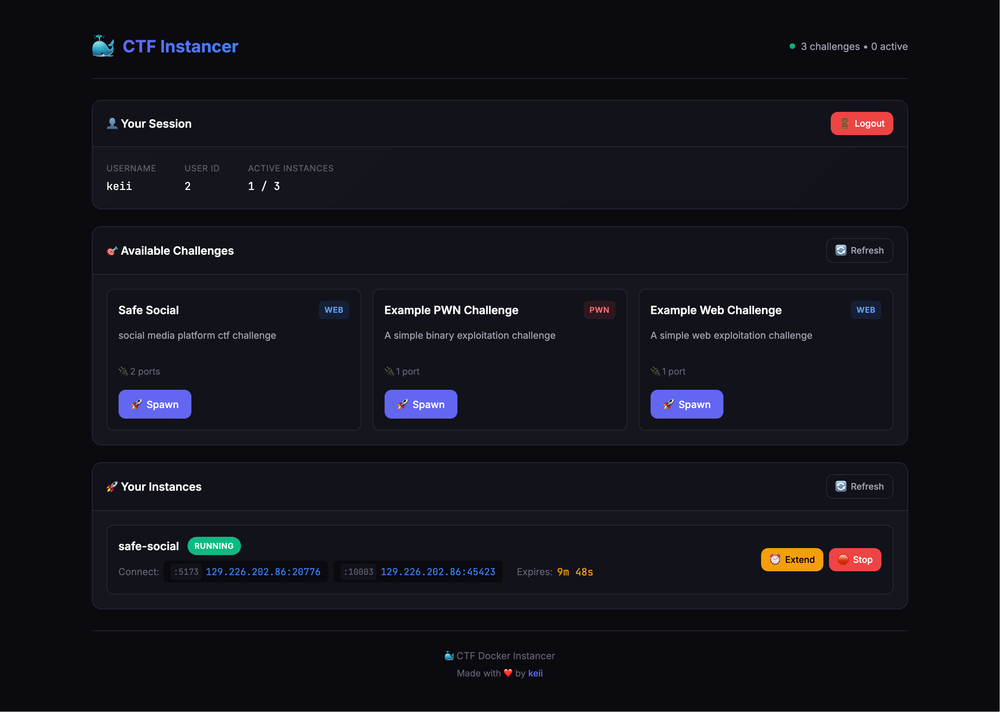
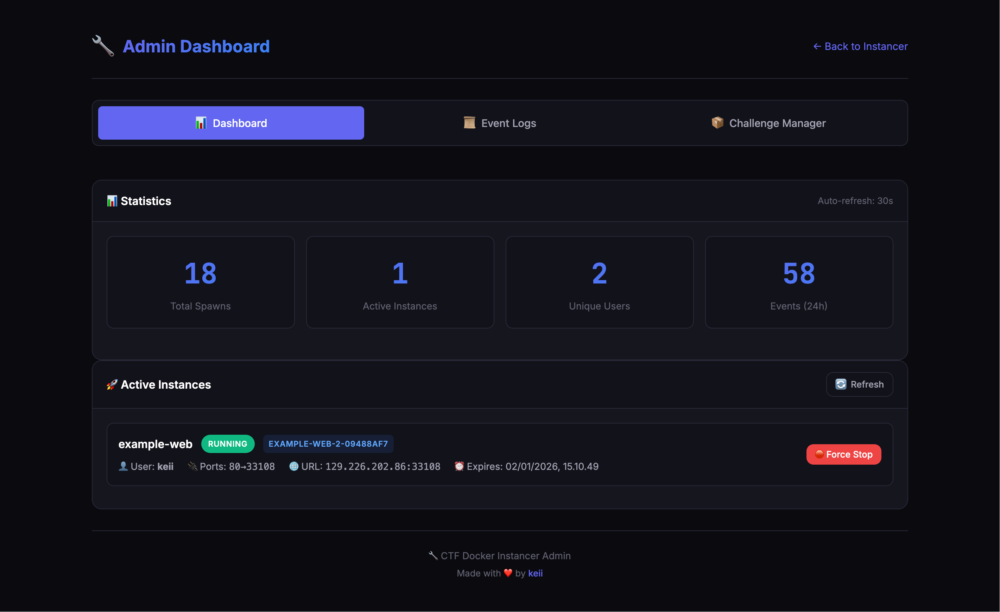
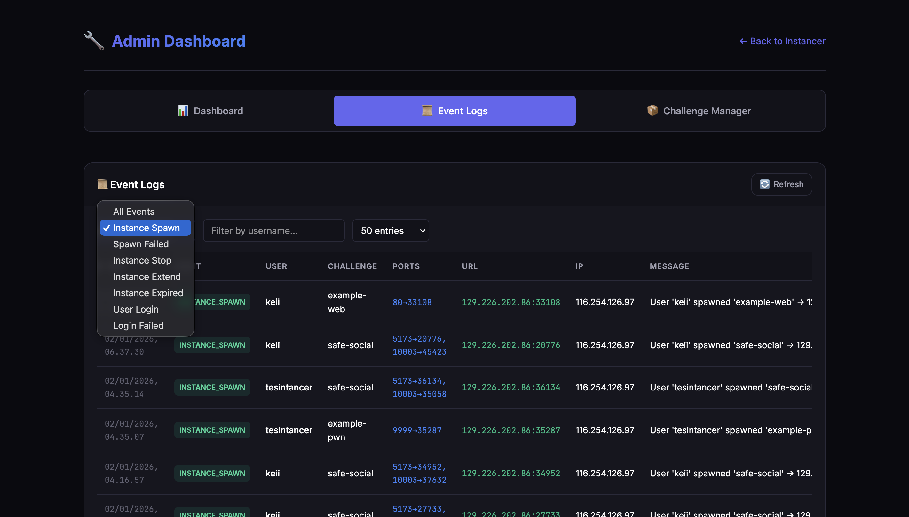
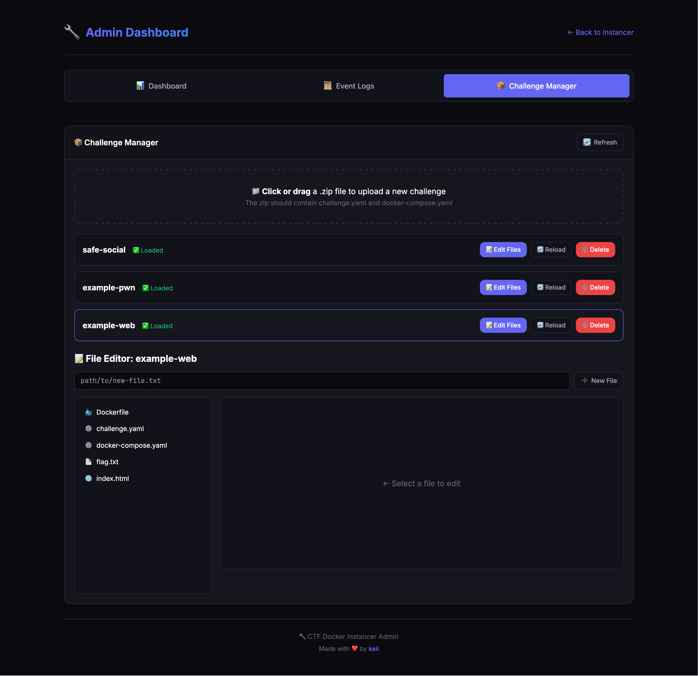
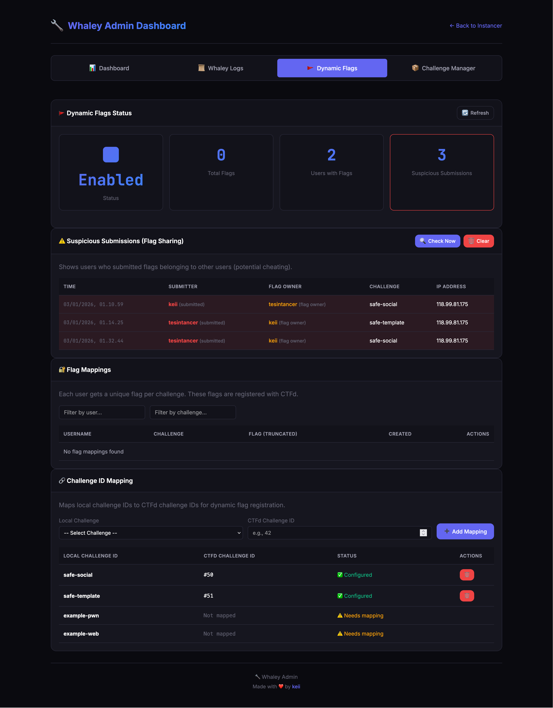
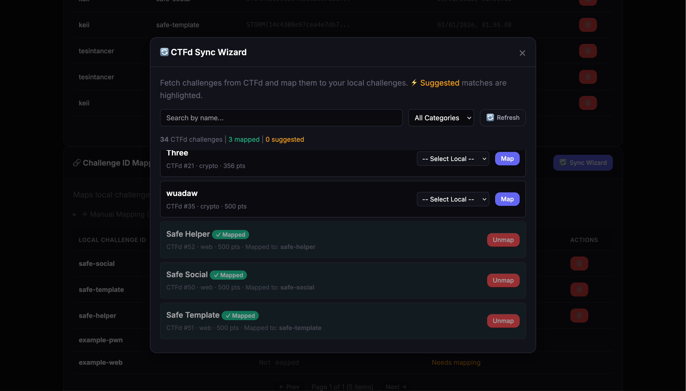

<h1 align="center">🐳 Whaley</h1>
<h3 align="center">Dedicated Docker Instancer for CTF Competitions</h3>

<p align="center">
  <a href="#-features">Features</a> •
  <a href="#-quick-start">Quick Start</a> •
  <a href="#-documentation">Documentation</a> •
  <a href="#-screenshots">Screenshots</a> •
  <a href="#-contributing">Contributing</a>
</p>

---

## 📋 Overview

**Whaley** is a production-ready Docker instance manager designed specifically for Capture The Flag (CTF) competitions. Deploy it on a dedicated server to provide each participant with their own isolated challenge environment—complete with automatic port allocation, resource limits, and seamless CTFd integration.

### Why Whaley?

| Problem | Whaley's Solution |
|---------|-------------------|
| Shared challenge instances cause interference | 🔒 **Isolated containers** per user/team |
| Manual port management is error-prone | 🎯 **Automatic port allocation** with collision prevention |
| No visibility into player resource usage | 📊 **Real-time monitoring** dashboard |
| Difficult to detect flag sharing | 🔍 **Suspicious submission detection** |
| Complex setup for dynamic flags | 💉 **Simple CTFd integration** with auto flag injection |

---

## ✨ Features

<table>
<tr>
<td width="50%" valign="top">

### 🚀 Core Functionality
- **Dynamic Instance Spawning** — Isolated Docker containers per user/team
- **Automatic Port Allocation** — Smart port management (10000-60000 range)
- **Multi-Port Challenges** — Support for complex multi-service challenges
- **Auto-Cleanup** — Instances automatically terminated after timeout
- **Docker Compose Support** — Standard `.yaml` and `.yml` formats
- **Resource Limits** — Memory and CPU constraints per instance

### 🔐 Authentication & Security
- **CTFd Integration** — Validate users via CTFd access tokens
- **No-Auth Mode** — IP-based identification for open events
- **Network Isolation** — Each instance in its own Docker network
- **Distributed Locking** — Redis-based locks for multi-worker safety

</td>
<td width="50%" valign="top">

### 🚩 Dynamic Flags
- **Unique Flags** — Each user/team gets unique flag per challenge
- **Auto Flag Injection** — Inject flags into challenge files at build time
- **CTFd Registration** — Automatically register flags with CTFd
- **Submission Monitoring** — Detect and log flag sharing attempts
- **Team Mode Support** — Shared flags per team when enabled

### 📊 Monitoring & Admin
- **Real-Time Metrics** — Live CPU/RAM usage per container
- **Instance Forensics** — Capture logs on termination or on-demand
- **Admin Dashboard** — Web UI for monitoring and management
- **Challenge Manager** — Upload & edit challenges without SSH
- **Event Logging** — Comprehensive audit trail with Docker errors

</td>
</tr>
</table>

---

## 🚀 Quick Start

### Prerequisites

- Docker Engine 24.0+ with Docker Compose v2
- 4+ CPU cores, 8GB+ RAM (see [capacity planning](#-capacity-planning))
- Linux server (Ubuntu 22.04+ or Debian 12+ recommended)

### Installation

```bash
# Clone the repository
git clone https://github.com/jonscafe/whaley.git
cd whaley

# Configure environment
cp .env.example .env
nano .env  # Edit with your settings

# Start Whaley
docker compose up -d
```

### Access Points

| Interface | URL | Description |
|-----------|-----|-------------|
| **User Dashboard** | `http://your-server:8000/` | Challenge spawning interface |
| **Admin Panel** | `http://your-server:8000/admin` | Monitoring & management |
| **API Docs** | `http://your-server:8000/docs` | Swagger API documentation |

---

## ⚙️ Configuration

### Essential Settings

```env
# Authentication
AUTH_MODE=ctfd                    # "ctfd" or "none"
CTFD_URL=https://your-ctfd.com    # Your CTFd instance URL
CTFD_API_KEY=ctfd_xxx...          # CTFd admin API key

# Network
PUBLIC_HOST=auto                  # VPS IP ("auto" for detection)
PORT_RANGE_START=20000
PORT_RANGE_END=50000

# Admin
ADMIN_KEY=your-secure-key         # Admin dashboard access key

# Dynamic Flags
DYNAMIC_FLAGS_ENABLED=true
FLAG_PREFIX=FLAG                  # e.g., FLAG{...}

# Team Mode
TEAM_MODE=auto                    # "auto", "enabled", or "disabled"
```

### Production Settings (Optional)

```env
# PostgreSQL for high availability
DATABASE_URL=postgresql+asyncpg://user:pass@db:5432/whaley

# Redis for distributed locking (required for multiple workers)
REDIS_URL=redis://redis:6379/0

# Network Isolation (recommended)
NETWORK_ISOLATION_ENABLED=true
NETWORK_ICC_DISABLED=true
```

> 📖 **Full configuration guide**: See [DOCUMENTATION.md](DOCUMENTATION.md#configuration)

---

## 📁 Challenge Structure

Create challenges in the `challenges/` directory:

```
challenges/
└── my-web-challenge/
    ├── challenge.yaml        # Challenge metadata
    ├── docker-compose.yaml   # Container definition
    ├── Dockerfile
    ├── flag.txt              # Flag file (auto-injected)
    └── src/
        └── app.py
```

### challenge.yaml

```yaml
id: my-web-challenge
name: "SQL Injection Lab"
category: web
description: "Can you bypass the login?"
ports:
  - 80
timeout: 3600  # 1 hour
```

### docker-compose.yaml

```yaml
services:
  web:
    build: .
    ports:
      - "${PORT_80}:80"
    environment:
      - FLAG=${FLAG}
    mem_limit: 256m
    cpus: 0.5
```

> 📖 **More examples**: See [DOCUMENTATION.md](DOCUMENTATION.md#challenge-structure)

---

## 👥 Team Mode

Whaley supports CTFd Team Mode where instances and flags are shared per-team:

| Feature | User Mode | Team Mode |
|---------|:---------:|:---------:|
| Instance Ownership | Per user | Per team |
| Dynamic Flags | Unique per user | Shared per team |
| Instance Control | Only spawner | Any team member |
| Suspicious Detection | User vs User | Team vs Team |

Enable with `TEAM_MODE=auto` to automatically detect from CTFd settings.

---

## 📊 Capacity Planning

### Estimation Formula

```
Concurrent Instances = Teams × Active Challenges × 0.5
RAM Required = Concurrent Instances × 256MB (average)
Ports Required = Concurrent Instances × Ports per Challenge
```

### Server Recommendations

| Event Size | CPU | RAM | Storage | Example |
|------------|:---:|:---:|:-------:|---------|
| **Small** (≤50 teams) | 4 cores | 8 GB | 40 GB SSD | Local CTFs |
| **Medium** (50-150 teams) | 8 cores | 32 GB | 100 GB SSD | University CTFs |
| **Large** (150-300 teams) | 16 cores | 64 GB | 200 GB SSD | National CTFs |

### Example Calculation

> **Scenario**: 150 teams, 5 active challenges, 2 ports each
>
> - Peak instances: 150 × 5 × 0.5 = **375 instances**
> - RAM needed: 375 × 256MB = **~96 GB** (recommend 64 GB with swap)
> - Ports needed: 375 × 2 = **750 ports**

---

## 📸 Screenshots

<table>
<tr>
<td align="center" width="50%">

<br><b>User Dashboard</b>
</td>
<td align="center" width="50%">

<br><b>Admin Dashboard</b>
</td>
</tr>
<tr>
<td align="center">

<br><b>Event Logs</b>
</td>
<td align="center">

<br><b>Challenge Manager</b>
</td>
</tr>
<tr>
<td align="center">

<br><b>Dynamic Flags</b>
</td>
<td align="center">

<br><b>CTFd Challenge Sync</b>
</td>
</tr>
</table>

---

## 📖 Documentation

For comprehensive documentation, see **[DOCUMENTATION.md](DOCUMENTATION.md)**:

- 🔧 [Installation & Configuration](DOCUMENTATION.md#installation)
- 📦 [Challenge Structure & Examples](DOCUMENTATION.md#challenge-structure)
- 🔌 [API Reference](DOCUMENTATION.md#api-reference)
- 🛡️ [Security Considerations](DOCUMENTATION.md#security)
- 📈 [Instance Forensics](DOCUMENTATION.md#instance-forensics)
- 🔍 [Resource Monitoring](DOCUMENTATION.md#resource-monitoring)
- 📊 [Capacity Planning](DOCUMENTATION.md#capacity-planning)

---

## 🤝 Contributing

Contributions are welcome! Here's how you can help:

1. **Fork** the repository
2. **Create** a feature branch (`git checkout -b feature/amazing-feature`)
3. **Commit** your changes (`git commit -m 'Add amazing feature'`)
4. **Push** to the branch (`git push origin feature/amazing-feature`)
5. **Open** a Pull Request

### Ideas for Contribution

- 🐛 Bug fixes and improvements
- 📝 Documentation enhancements
- 🎨 UI/UX improvements
- 🧪 Test coverage
- 🌐 Internationalization

---

## 📄 License

This project is licensed under the **MIT License** — see the [LICENSE](LICENSE) file for details.

---

## 👨‍💻 Author

<table>
<tr>
<td align="center">
<a href="https://github.com/jonscafe">

<br />
<b>keii</b>
</a>
<br />
<sub>Creator & Maintainer</sub>
</td>
</tr>
</table>

---

<p align="center">
Built with ❤️ for the CTF community
<br><br>
<b>If you find Whaley useful, please consider giving it a ⭐</b>
<br><br>
<a href="https://github.com/jonscafe/whaley">

</a>
</p>
