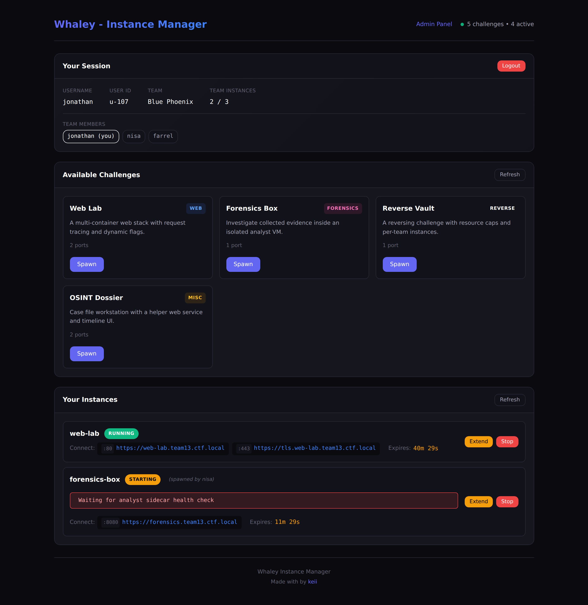
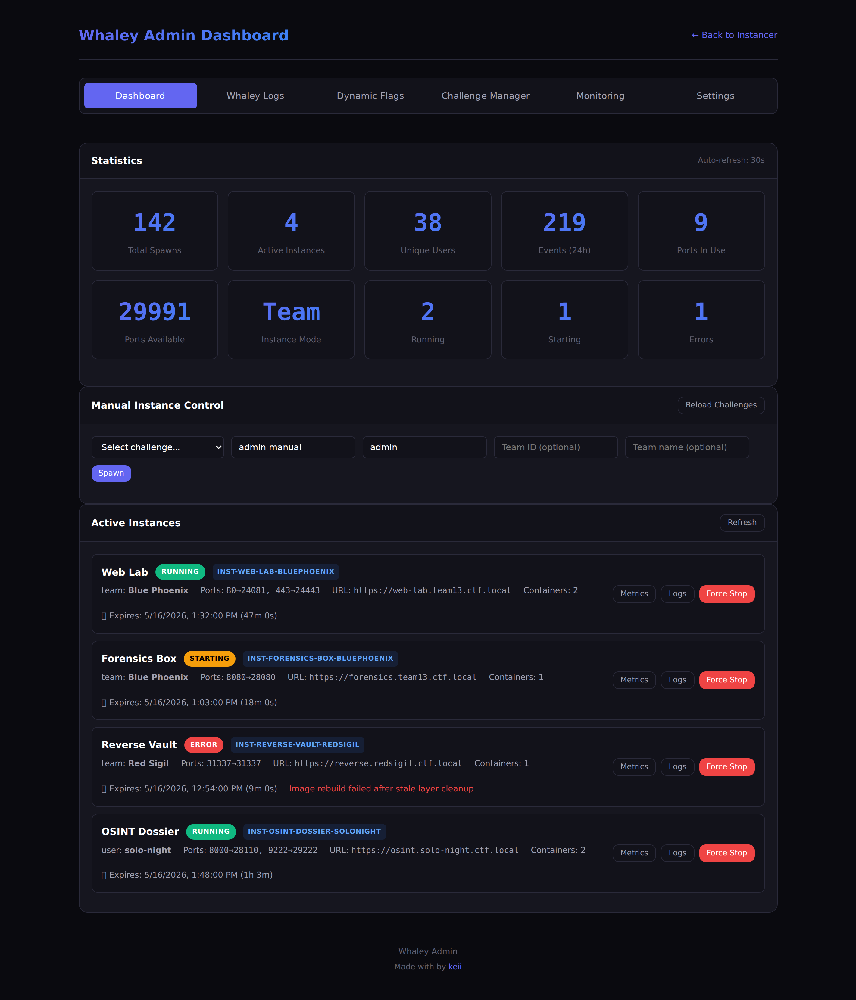
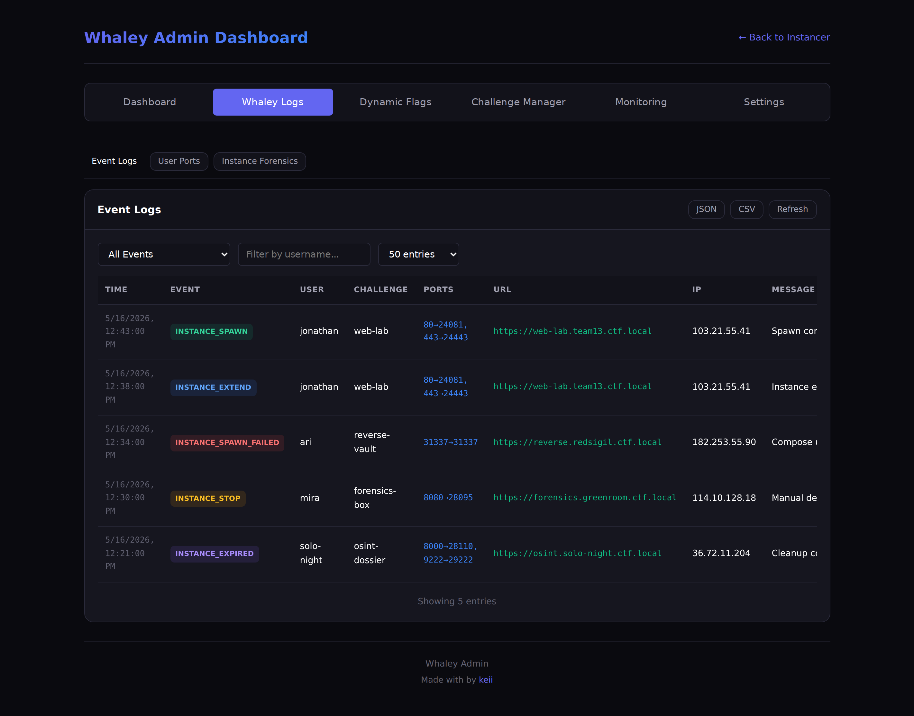
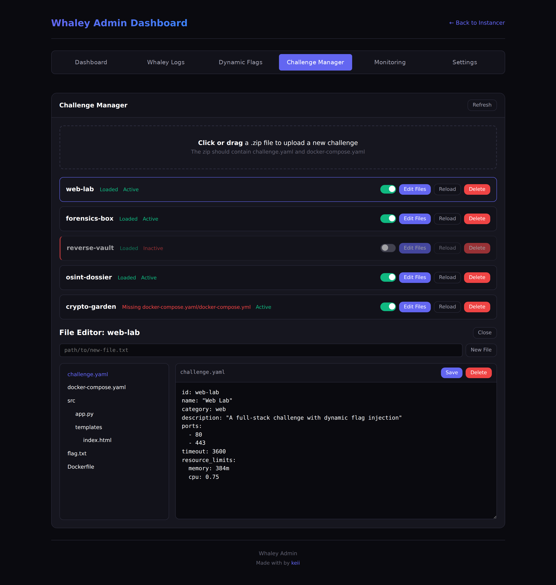
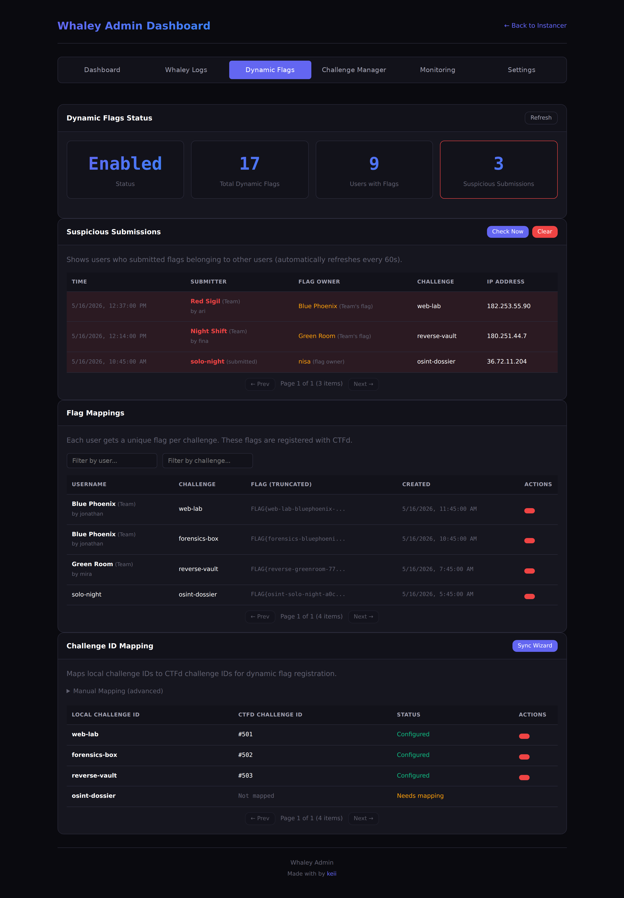
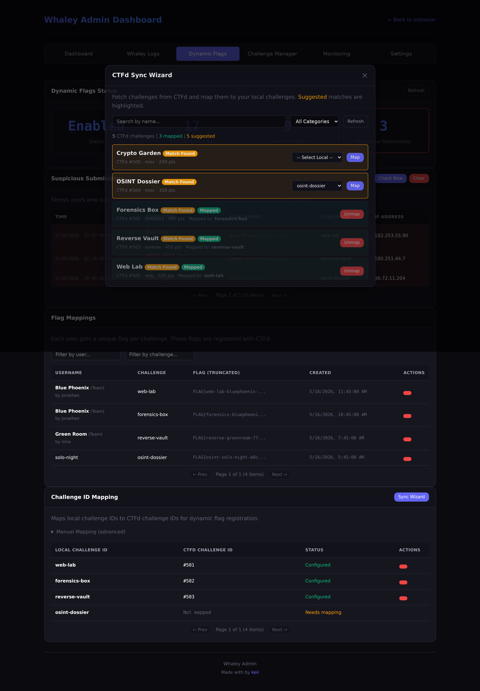

<h1 align="center">🐳 Whaley</h1>
<h3 align="center">Dedicated Docker Instancer for CTF Competitions</h3>

<p align="center">
  <a href="#-features">Features</a> •
  <a href="#-quick-start">Quick Start</a> •
  <a href="#-documentation">Documentation</a> •
  <a href="#-screenshots">Screenshots</a> •
  <a href="#-contributing">Contributing</a>
</p>

---

## 📋 Overview

**Whaley** is a production-ready Docker instance manager designed specifically for Capture The Flag (CTF) competitions. Deploy it on a dedicated server to provide each participant with their own isolated challenge environment—complete with automatic port allocation, resource limits, and seamless CTFd integration.

### Why Whaley?

| Problem | Whaley's Solution |
|---------|-------------------|
| Shared challenge instances cause interference | 🔒 **Isolated containers** per user/team |
| Manual port management is error-prone | 🎯 **Automatic port allocation** with collision prevention |
| No visibility into player resource usage | 📊 **Real-time monitoring** dashboard |
| Difficult to detect flag sharing | 🔍 **Suspicious submission detection** |
| Complex setup for dynamic flags | 💉 **Simple CTFd integration** with auto flag injection |

---

## ✨ Features

<table>
<tr>
<td width="50%" valign="top">

### 🚀 Core Functionality
- **Dynamic Instance Spawning** — Isolated Docker containers per user/team
- **Automatic Port Allocation** — Smart port management (10000-60000 range)
- **Multi-Port Challenges** — Support for complex multi-service challenges
- **Auto-Cleanup** — Instances automatically terminated after timeout
- **Docker Compose Support** — Standard `.yaml` and `.yml` formats
- **Enforced Resource Limits** — Global memory, CPU & PID caps enforced on all containers
- **Per-Challenge Resource Overrides** — Fine-tune limits per challenge from admin panel

### 🔐 Authentication & Security
- **CTFd Integration** — Validate users and admin RBAC via CTFd access tokens
- **No-Auth Mode** — IP-based identification for open events
- **Network Isolation** — Each instance in its own Docker network
- **Distributed Locking** — Redis-based locks for multi-worker safety
- **Fork Bomb Protection** — PID limits per container

</td>
<td width="50%" valign="top">

### 🚩 Dynamic Flags
- **Unique Flags** — Each user/team gets unique flag per challenge
- **Auto Flag Injection** — Inject flags into challenge files at build time
- **CTFd Registration** — Automatically register flags with CTFd
- **Submission Monitoring** — Detect and log flag sharing attempts
- **Team Mode Support** — Shared flags per team when enabled

### 📊 Monitoring & Admin
- **Real-Time Metrics** — Live CPU/RAM usage per container
- **Instance Forensics** — Capture logs on termination or on-demand
- **Admin Dashboard** — Web UI for monitoring and management
- **Challenge Manager** — Upload & edit challenges without SSH
- **Challenge Toggle** — Activate/deactivate challenges from admin panel
- **Admin Settings UI** — Configure all Whaley settings via the web UI (no env/compose edits needed)
- **Event Logging** — Comprehensive audit trail with Docker errors

</td>
</tr>
</table>

---

## 🚀 Quick Start

### Prerequisites

- Docker Engine 24.0+ with Docker Compose v2
- 4+ CPU cores, 8GB+ RAM (see [capacity planning](#-capacity-planning))
- Linux server (Ubuntu 22.04+ or Debian 12+ recommended)

### Installation

```bash
# Clone the repository
git clone https://github.com/jonscafe/whaley.git
cd whaley

# Configure environment
cp .env.example .env
nano .env  # Edit with your settings

# Start Whaley
docker compose up -d
```

### Access Points

| Interface | URL | Description |
|-----------|-----|-------------|
| **User Dashboard** | `http://your-server:8000/` | Challenge spawning interface |
| **Admin Panel** | `http://your-server:8000/admin` | Monitoring & management |
| **API Docs** | `http://your-server:8000/docs` | Swagger API documentation |

---

## ⚙️ Configuration

### Essential Settings

```env
# Authentication
AUTH_MODE=ctfd                    # "ctfd" or "none"
CTFD_URL=https://your-ctfd.com    # Your CTFd instance URL
CTFD_API_KEY=ctfd_xxx...          # CTFd admin API key for dynamic flags/sync

# Network
PUBLIC_HOST=auto                  # VPS IP ("auto" for detection)
PORT_RANGE_START=20000
PORT_RANGE_END=50000

# Admin
ADMIN_KEY=your-secure-key         # Local admin key when AUTH_MODE=none

# Dynamic Flags
DYNAMIC_FLAGS_ENABLED=true
FLAG_PREFIX=FLAG                  # e.g., FLAG{...}

# Team Mode
TEAM_MODE=auto                    # "auto", "enabled", or "disabled"
```

### Production Settings (Optional)

```env
# PostgreSQL for high availability
DATABASE_URL=postgresql+asyncpg://user:pass@db:5432/whaley

# Redis for distributed locking (required for multiple workers)
REDIS_URL=redis://redis:6379/0

# Network Isolation (recommended)
NETWORK_ISOLATION_ENABLED=true
NETWORK_ICC_DISABLED=true
TRUSTED_PROXIES=127.0.0.1,::1     # Only these proxies may set client IP headers

# Resource Limits (enforced on all containers)
CONTAINER_MAX_MEMORY=512m         # Max memory per container
CONTAINER_MAX_CPU=1.0             # Max CPU cores per container
CONTAINER_PIDS_LIMIT=256          # Max PIDs per container (fork bomb protection)
```

> 💡 **Tip**: Most settings (including Authentication & CTFd integration) can be configured instantly via the **Admin Panel → ⚙️ Settings** tab.

> 🔐 **Admin access**: In `AUTH_MODE=ctfd`, Whaley validates the submitted CTFd access token against CTFd's `/api/v1/users/me` endpoint and only enables `/admin` for users whose CTFd user type is `admin`. In `AUTH_MODE=none`, admin APIs use the local `ADMIN_KEY` fallback.

> 📖 **Full configuration guide**: See [DOCUMENTATION.md](DOCUMENTATION.md#configuration)

---

## 📁 Challenge Structure

Create challenges in the `challenges/` directory:

```
challenges/
└── my-web-challenge/
    ├── challenge.yaml        # Challenge metadata
    ├── docker-compose.yaml   # Container definition
    ├── Dockerfile
    ├── flag.txt              # Flag file (auto-injected)
    └── src/
        └── app.py
```

### challenge.yaml

```yaml
id: my-web-challenge
name: "SQL Injection Lab"
category: web
description: "Can you bypass the login?"
ports:
  - 80
timeout: 3600  # 1 hour
```

### docker-compose.yaml

```yaml
services:
  web:
    build: .
    ports:
      - "${PORT_80}:80"
    environment:
      - FLAG=${FLAG}
    mem_limit: 256m
    cpus: 0.5
```

> ⚠️ **Resource enforcement**: Even if a challenge sets `mem_limit: 2g`, Whaley will cap it to the global `CONTAINER_MAX_MEMORY` (default `512m`). You can set per-challenge overrides via the admin panel.

> 🛡️ **Compose hardening**: Whaley prepares every spawn from a per-instance copy, attaches the instance network automatically, and rejects dangerous compose options such as `privileged`, `network_mode`, host/container namespace sharing, added capabilities/devices, Docker socket mounts, external networks/volumes, unsafe build/env file paths, symlinks, and bind mounts that escape the challenge directory.

> 📖 **More examples**: See [DOCUMENTATION.md](DOCUMENTATION.md#challenge-structure)

---

## 👥 Team Mode

Whaley supports CTFd Team Mode where instances and flags are shared per-team:

| Feature | User Mode | Team Mode |
|---------|:---------:|:---------:|
| Instance Ownership | Per user | Per team |
| Dynamic Flags | Unique per user | Shared per team |
| Instance Control | Only spawner | Any team member |
| Suspicious Detection | User vs User | Team vs Team |

Enable with `TEAM_MODE=auto` to automatically detect from CTFd settings.

---

## 📊 Capacity Planning

### Estimation Formula

```
Concurrent Instances = Teams × Active Challenges × 0.5
RAM Required = Concurrent Instances × 256MB (average)
Ports Required = Concurrent Instances × Ports per Challenge
```

### Server Recommendations

| Event Size | CPU | RAM | Storage | Example |
|------------|:---:|:---:|:-------:|---------|
| **Small** (≤50 teams) | 4 cores | 8 GB | 40 GB SSD | Local CTFs |
| **Medium** (50-150 teams) | 8 cores | 32 GB | 100 GB SSD | University CTFs |
| **Large** (150-300 teams) | 16 cores | 64 GB | 200 GB SSD | National CTFs |

### Example Calculation

> **Scenario**: 150 teams, 5 active challenges, 2 ports each
>
> - Peak instances: 150 × 5 × 0.5 = **375 instances**
> - RAM needed: 375 × 256MB = **~96 GB** (recommend 64 GB with swap)
> - Ports needed: 375 × 2 = **750 ports**

---

## 📸 Screenshots

<table>
<tr>
<td align="center" width="50%">

<br><b>User Dashboard</b>
</td>
<td align="center" width="50%">

<br><b>Admin Dashboard</b>
</td>
</tr>
<tr>
<td align="center">

<br><b>Event Logs</b>
</td>
<td align="center">

<br><b>Challenge Manager</b>
</td>
</tr>
<tr>
<td align="center">

<br><b>Dynamic Flags</b>
</td>
<td align="center">

<br><b>CTFd Challenge Sync</b>
</td>
</tr>
</table>

---

## ⚙️ Admin Settings & Challenge Management

### Live Settings (No Restart Required)

All key Whaley settings can be changed at runtime via the **Admin Panel → ⚙️ Settings** tab:

| Category | Settings |
|----------|----------|
| **Instance** | Timeout, max instances per user/team |
| **Resources** | Container max memory, CPU cores, PID limit |
| **Network** | Port range, isolation, public host |
| **Features** | Dynamic flags, flag prefix |
| **Authentication** | Auth mode (CTFd/None), CTFd URL, CTFd API key, local Admin Key fallback |
| **Forensics** | Auto capture, retention period |

Changes persist to the database and survive container restarts—no need to edit `docker-compose.yaml` or `.env` files.

### Challenge Active/Inactive Toggle

Control which challenges are visible and spawnable from the **Challenge Manager** tab:

- **🟢 Active** — Visible on the user dashboard, can be spawned
- **🔴 Inactive** — Hidden from users, spawn requests rejected (HTTP 403)

Use this during competitions to stage challenges for later rounds, or to quickly disable a broken challenge without deleting it.

Challenge uploads reject path traversal, absolute paths, and symlinks. Runtime challenge trees are also rejected if they contain symlinks. The browser editor only writes text files up to 2 MB, and Whaley blocks deleting a challenge while active instances are still using it.

### Enforced Resource Limits

Whaley enforces maximum resource limits on **every** container, regardless of what the challenge's `docker-compose.yaml` specifies:

```
CONTAINER_MAX_MEMORY=512m    # Caps mem_limit in compose files
CONTAINER_MAX_CPU=1.0        # Caps cpus in compose files
CONTAINER_PIDS_LIMIT=256     # Injects pids_limit (fork bomb protection)
```

Per-challenge overrides can be set via the admin API if certain challenges need more resources.

---

## 📖 Documentation

For comprehensive documentation, see **[DOCUMENTATION.md](DOCUMENTATION.md)**:

- 🔧 [Installation & Configuration](DOCUMENTATION.md#installation)
- 📦 [Challenge Structure & Examples](DOCUMENTATION.md#challenge-structure)
- 🔌 [API Reference](DOCUMENTATION.md#api-reference)
- 🛡️ [Security Considerations](DOCUMENTATION.md#security)
- 📈 [Instance Forensics](DOCUMENTATION.md#instance-forensics)
- 🔍 [Resource Monitoring](DOCUMENTATION.md#resource-monitoring)
- 📊 [Capacity Planning](DOCUMENTATION.md#capacity-planning)
- ⚙️ [Admin Settings & Challenge Management](DOCUMENTATION.md#admin-settings)

---

## 🤝 Contributing

Contributions are welcome! Here's how you can help:

1. **Fork** the repository
2. **Create** a feature branch (`git checkout -b feature/amazing-feature`)
3. **Commit** your changes (`git commit -m 'Add amazing feature'`)
4. **Push** to the branch (`git push origin feature/amazing-feature`)
5. **Open** a Pull Request

### Ideas for Contribution

- 🐛 Bug fixes and improvements
- 📝 Documentation enhancements
- 🎨 UI/UX improvements
- 🧪 Test coverage
- 🌐 Internationalization

---

## 📄 License

This project is licensed under the **MIT License** — see the [LICENSE](LICENSE) file for details.

---

## 👨‍💻 Author

<table>
<tr>
<td align="center">
<a href="https://github.com/jonscafe">

<br />
<b>keii</b>
</a>
<br />
<sub>Creator & Maintainer</sub>
</td>
</tr>
</table>

---

<p align="center">
Built with ❤️ for the CTF community
<br><br>
<b>If you find Whaley useful, please consider giving it a ⭐</b>
<br><br>
<a href="https://github.com/jonscafe/whaley">

</a>
</p>
